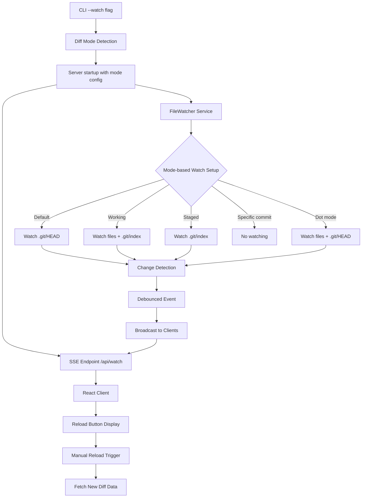

# 設計ドキュメント

## 概要

difitにGitHubライクなReloadボタン機能を追加し、表示中のdiffモードに応じた変更を検知して手動更新を可能にします。この設計では、既存のSSEアーキテクチャを拡張し、@parcel/watcherによる効率的な監視とReactベースのUI統合を実装します。

### 監視対象の動的決定

difitの実行モードに基づいて監視対象を動的に設定：
- **デフォルト（`difit`）**: `.git/HEAD`の変更（新コミット検知）
- **working（`difit working`）**: 作業ディレクトリファイル + `.git/index`（ステージング状態）
- **staged（`difit staged`）**: `.git/index`の変更（ステージング状態）
- **全変更（`difit .`）**: 作業ディレクトリファイル + `.git/HEAD`（新コミット検知）
- **特定コミット（`difit abc123`）**: 監視無効（コミットは不変）

## アーキテクチャ

### 全体構成

```
CLI (--watch flag + diff mode detection)
    ↓
Server (Express + @parcel/watcher + Mode-based watching)
    ↓ SSE
React Client (Reload Button)
```

### 主要コンポーネント関係図



## コンポーネントと インターフェース

### 1. FileWatcher Service (サーバーサイド)

**責任**: diffモードに応じた監視設定とイベント配信

**主要メソッド**:
```typescript
interface FileWatcherService {
  start(diffMode: DiffMode, watchPath: string): void
  stop(): void
  addClient(res: Response): void
  removeClient(res: Response): void
  broadcastChange(): void
  private setupWatchers(mode: DiffMode): void
}

enum DiffMode {
  DEFAULT = 'default',    // HEAD^ vs HEAD
  WORKING = 'working',    // staged vs working
  STAGED = 'staged',      // HEAD vs staged
  DOT = 'dot',           // HEAD vs working (all changes)
  SPECIFIC = 'specific'   // commit vs commit (no watching)
}
```

**実装詳細**:
- @parcel/watcher を使用（ネイティブC++実装による高性能）
- diffモードに応じた監視対象の動的設定
- 300msのデバウンス実装
- モード別除外パターンの適用
- クライアント接続管理

### 2. SSE Handler (サーバーサイド)

**責任**: Server-Sent Eventsによるリアルタイム通信

**エンドポイント**: `GET /api/watch`

**イベント形式**:
```typescript
interface WatchEvent {
  type: 'reload' | 'error' | 'connected'
  timestamp: string
  message?: string
}
```

### 3. ReloadButton Component (クライアントサイド)

**責任**: 変更通知の受信とReloadボタンの表示制御

**Props Interface**:
```typescript
interface ReloadButtonProps {
  onReload: () => Promise<void>
  className?: string
}
```

**State Interface**:
```typescript
interface ReloadButtonState {
  shouldReload: boolean
  isReloading: boolean
  error: string | null
}
```

### 4. useFileWatch Hook (クライアントサイド)

**責任**: SSE接続とファイル変更状態の管理

**返り値**:
```typescript
interface FileWatchHook {
  shouldReload: boolean
  isConnected: boolean
  error: string | null
  reload: () => Promise<void>
}
```

## データモデル

### FileWatcher Configuration

```typescript
interface FileWatchConfig {
  watchPath: string
  diffMode: DiffMode
  ignore: string[]
  debounceMs: number
  backend?: 'fs-events' | 'watchman' | 'windows' | 'linux'
}

interface ModeWatchConfig {
  [DiffMode.DEFAULT]: {
    watchPaths: ['.git/HEAD']
    ignore: ['.git/objects/**', '.git/refs/**', 'node_modules/**']
  }
  [DiffMode.WORKING]: {
    watchPaths: ['.', '.git/index']
    ignore: ['.git/**', 'node_modules/**', '!.git/index']
  }
  [DiffMode.STAGED]: {
    watchPaths: ['.git/index']
    ignore: ['.git/objects/**', '.git/refs/**']
  }
  [DiffMode.DOT]: {
    watchPaths: ['.', '.git/HEAD']
    ignore: ['.git/**', 'node_modules/**', '!.git/HEAD']
  }
  [DiffMode.SPECIFIC]: {
    watchPaths: []  // No watching for specific commits
    ignore: []
  }
}
```

### SSE Message Format

```typescript
interface SSEMessage {
  data: WatchEvent
  id?: string
  event?: string
}

interface WatchEvent {
  type: 'reload' | 'error' | 'connected'
  diffMode: DiffMode
  changeType: 'file' | 'commit' | 'staging'
  timestamp: string
  message?: string
}
```

### Client State

```typescript
interface ClientWatchState {
  isWatchEnabled: boolean
  diffMode: DiffMode
  shouldReload: boolean
  isReloading: boolean
  lastChangeTime: Date | null
  lastChangeType: 'file' | 'commit' | 'staging' | null
  connectionStatus: 'connected' | 'disconnected' | 'reconnecting'
}
```

## エラーハンドリング

### ファイル監視エラー

1. **Permission Denied**: ファイル監視権限なし
   - フォールバック: 監視無効化とエラーメッセージ表示
   
2. **Path Not Found**: 監視対象パス不存在
   - 処理: 現在のworking directoryを使用

3. **Resource Exhaustion**: システムリソース不足
   - 処理: 監視停止と警告表示

### SSE接続エラー

1. **Connection Lost**: サーバー接続切断
   - 処理: 3秒間隔での自動再接続（最大5回）
   
2. **Network Error**: ネットワークエラー
   - 処理: 接続状態をUI表示、手動再接続オプション

### Gitリポジトリエラー

1. **Git Command Failure**: Git操作失敗
   - 処理: エラー状態表示とリトライボタン
   
2. **Repository Not Found**: リポジトリ不存在
   - 処理: 明確なエラーメッセージと対処法表示

## テストストラテジー

### 1. Unit Tests

**FileWatcher Service**:
- diffモード検知とモード別監視設定
- ファイル変更検知（作業ディレクトリ）
- Git状態変更検知（.git/HEAD, .git/index）
- デバウンス機能
- モード別除外パターン動作
- クライアント管理

**ReloadButton Component**:
- 状態変更による表示切替
- ボタンクリック時の動作
- ローディング状態表示
- エラー状態表示

**useFileWatch Hook**:
- SSE接続管理
- 状態更新ロジック
- エラーハンドリング

### 2. Integration Tests

**Server-Client Communication**:
- SSE接続確立
- ファイル変更通知の配信
- 接続切断・再接続

**End-to-End Workflow**:
- CLIから監視開始
- ファイル変更からUI更新まで
- Reloadボタンクリックから差分更新まで

### 3. Manual Testing Scenarios

1. **モード別基本機能**:
   - デフォルトモード: 新コミット後のReloadボタン表示
   - workingモード: ファイル変更・ステージング変更後のReloadボタン表示
   - stagedモード: ステージング変更後のReloadボタン表示
   - dotモード: ファイル変更・新コミット後のReloadボタン表示
   - 特定コミット: 監視無効の確認

2. **Git操作との連携**:
   - git commit後の動作（DEFAULTとDOTモード）
   - git add/reset後の動作（WORKINGとSTAGEDモード）
   - git checkout後の動作（全モード）

3. **エラーケース**:
   - サーバー切断時の動作
   - 権限不足時の処理
   - 大量ファイル変更時の性能

4. **UI/UX**:
   - GitHubライクな見た目
   - モード別の適切なメッセージ表示
   - ローディング状態の表示
   - レスポンシブ対応

## @parcel/watcher の利点

### パフォーマンス優位性
- **ネイティブC++実装**: OSのファイル監視APIを直接使用し高性能
- **イベント統合**: C++レベルでイベントがスロットリング・統合されJSスレッドの負荷軽減
- **最適化された除外処理**: 除外ディレクトリに対してwatcherを作成せず、ファイルディスクリプタ不足を回避

### 技術的優位性
- **履歴クエリ機能**: プログラム停止中の変更も検知可能（スナップショット機能）
- **Watchman統合**: Linuxでキャッシュ利用によるパフォーマンス向上
- **プラットフォーム最適化**: macOS (FSEvents)、Windows、Linux各々に最適化されたバックエンド

### 設定例
```typescript
import { subscribe } from '@parcel/watcher';

const subscription = await subscribe(
  process.cwd(),
  (err, events) => {
    if (err) throw err;
    
    // イベントはすでにC++レベルで統合・最適化済み
    const relevantEvents = events.filter(event => 
      !event.path.includes('node_modules') &&
      !event.path.includes('.git')
    );
    
    if (relevantEvents.length > 0) {
      broadcastReloadEvent();
    }
  },
  {
    ignore: ['node_modules/**', '.git/**', 'dist/**']
  }
);
```

## 実装優先順位

### Phase 1: Core Implementation
- @parcel/watcher による FileWatcher Serviceの実装
- SSE エンドポイントの追加
- 基本的なReloadButton Component

### Phase 2: UI Enhancement
- GitHubライクなスタイリング
- ローディング状態とアニメーション
- エラー状態の表示

### Phase 3: Robustness
- 包括的なエラーハンドリング
- 再接続ロジック
- パフォーマンス最適化

### Phase 4: Testing & Polish
- テストカバレッジの確保
- ドキュメント作成
- エッジケースの対応